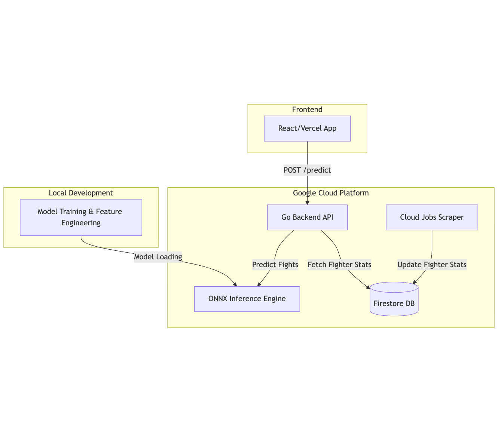

# UFC Fight Prediction & Analytics Platform

## Project Overview

This project is a fullstack ML platform used for predicting UFC fight outcomes. It uses an automated data pipeline, feature engineering, a neural network served via ONNX runtime, and a React frontend to deliver fight outcome predictions.

This app supports generating predictions for fight outcomes (red/blue via ko/sub/dec) for any fantasy matchup of UFC fighters. Predictions are served from the backend in ~100ms thanks to a Go backend using Gin web framework and ONNX runtime to support model inference. The model is trained on 50+ handcrafted features to capture dynamics of a fight, including momentum (win/finish streaks), elo ratings, rates of finishes, etc.

## Motivation

This project began as a simple stats dashboard I built to learn Pandas. However, I decided to transform it into an application that could predict UFC fight outcomes so that I could learn ML as well as fullstack development. By building a backend prediction system that supports accurate, low-latency predictions, as well as a full data scraping an engineering pipeline, I was able to learn lots of technical skills all while building a platform that displayed my passion for UFC and ML.

## Tech Stack & Architecture

**Frontend:** React, deployed on Vercel  
**Backend:** Go API leveraging Goroutines for high concurrency and ONNX Runtime for low-latency inference.
**Machine Learning:** PyTorch neural network served via ONNX runtime
**Data Pipeline:**
- Automated scraper service (BeautifulSoup) deployed as scheduled Cloud Run job
- Runs weekly post-UFC events to update fighter statistics
- Firestore NoSQL database to store fighter statistics for quick reads.
**Deployment:** API for predictions that handles reads from database, feature engineering, and inference.

## Real-World Performance

Validated on 75+ real UFC fights (unseen during training):
- **Winner Predictions:** 60/78 correct (76.9% accuracy)
- **Outcome Type Predictions:** 32/78 correct (41.0% accuracy)

## Key Features

- **Real-time Predictions:** Generates fight winner probabilities and expected finish methods
- **Automated Data Pipeline:** Weekly scraping and feature engineering of fighter statistics with Firebase storage
- **Low-Latency Prediction Serving** Uses Goroutines for concurrent database + model loading calls in backend
- **Production Architecture:** Containerized prediction service with cloud deployment and low latency

## Live Demo

**Frontend:** https://mma-predictor.vercel.app/  