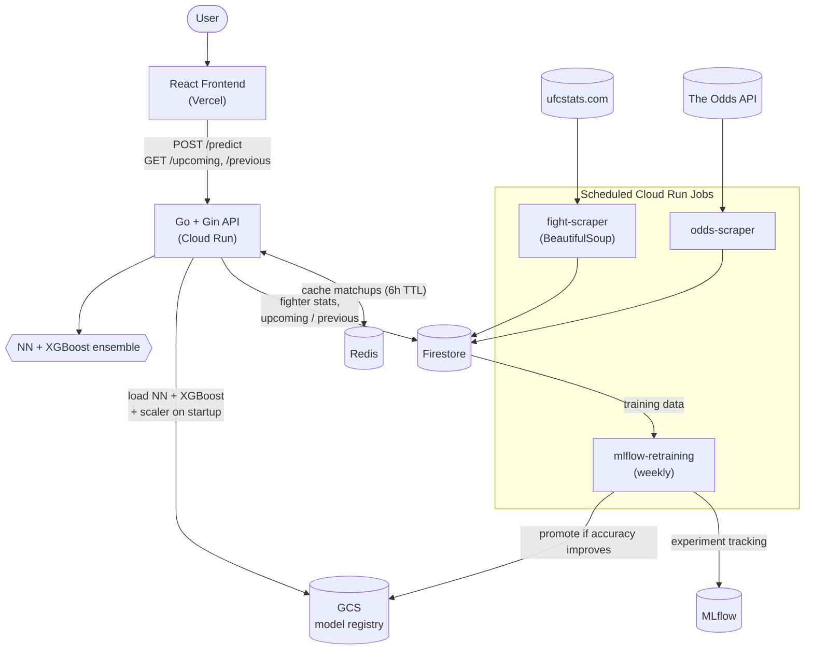

# UFC Fight Prediction & Analytics Platform


A full-stack ML platform that predicts UFC fight outcomes — winner, win probability, and
most likely finish method — from an automated data pipeline, a heterogeneous model ensemble,
and a low-latency Go serving layer. It also runs a full MLOps retraining loop (experiment
tracking + accuracy-gated promotion) and ingests live bookmaker odds to surface fights where
the model disagrees most with the market.

**Live demo:** https://mma-predictor.vercel.app/

---

## Architecture


```mermaid
flowchart TB
    User([User]) --> FE["React Frontend<br/>(Vercel)"]
    FE -->|"POST /predict<br/>GET /upcoming, /previous"| API["Go + Gin API<br/>(Cloud Run)"]

    API <-->|"cache matchups (6h TTL)"| Redis[("Redis")]
    API -->|"fighter stats,<br/>upcoming / previous"| FS[("Firestore")]
    API -->|"load NN + XGBoost<br/>+ scaler on startup"| GCS[("GCS<br/>model registry")]
    API --> ENS{{"NN + XGBoost ensemble"}}

    subgraph Jobs["Scheduled Cloud Run Jobs"]
        Scraper["fight-scraper<br/>(BeautifulSoup)"]
        Odds["odds-scraper"]
        Retrain["mlflow-retraining<br/>(weekly)"]
    end

    UFCStats[("ufcstats.com")] --> Scraper --> FS
    OddsAPI[("The Odds API")] --> Odds --> FS
    FS -->|"training data"| Retrain
    Retrain -->|"experiment tracking"| MLflow[("MLflow")]
    Retrain -->|"promote if accuracy improves"| GCS
```

## Tech stack

| Layer      | Technologies |
| ---------- | ------------ |
| Serving    | Go, Gin, ONNX Runtime, Redis |
| ML         | PyTorch, XGBoost, scikit-learn, ONNX |
| MLOps      | MLflow, Google Cloud Storage (model registry) |
| Data       | BeautifulSoup, Firestore, The Odds API |
| Frontend   | React, MUI, Vite (deployed on Vercel) |
| Infra      | Docker, Google Cloud Run, Google Cloud Storage |

## How a prediction works

1. The frontend sends a red/blue fighter matchup to `POST /predict`.
2. The API checks **Redis** for a cached result (matchups cached with a 6-hour TTL).
3. On a miss, it fetches both fighters' stats from **Firestore** concurrently (goroutines).
4. It engineers **56 features** (differentials, Elo, momentum/finish streaks, rates, etc.) and
   scales them with the production `StandardScaler` parameters loaded from GCS.
5. The **NN and XGBoost models run concurrently** and their class probabilities are averaged.
6. The result — win probability and most likely finish method (KO/TKO, submission, decision) —
   is cached and returned.

Warm responses are served in roughly **30 ms** on a Redis cache hit; a full cold path
(Firestore reads + feature engineering + ensemble inference) is on the order of **100 ms**.

## Machine learning

- **Heterogeneous ensemble.** A PyTorch neural network (GELU, batch norm, dropout, 256→128→64→32→6)
  and an XGBoost classifier are averaged at the probability level. The smooth-boundary net and the
  step-boundary tree make different errors, so the ensemble generalizes better than either alone.
- **Leakage-safe training.** A **temporal** train/validation split (train on older fights, validate
  on the most recent) mirrors real deployment instead of shuffling across time.
- **Corner-debiasing augmentation.** Every training sample is mirrored with the red/blue corners
  swapped (individual features exchanged, differential features negated, labels remapped) to remove
  the dataset's red-corner-favorite bias.
- **Mixup regularization.** Synthetic samples that interpolate feature/label pairs smooth decision
  boundaries and reduce overfitting on tabular data.
- Training uses AdamW, cosine-annealing warm restarts, label smoothing, and early stopping.

## Data & MLOps pipeline

- **Scraping.** A scheduled Cloud Run job scrapes fighter statistics and fight results from
  ufcstats.com, cleans them, engineers features, and writes them to Firestore. It also records
  predictions for upcoming cards and scores past predictions for live accuracy tracking.
- **Odds & edge.** A second job pulls live bookmaker lines from The Odds API, removes the vig to
  get market-implied win probabilities, and flags fights where the model's win probability is
  meaningfully higher than the market's (the model **edge**).
- **Retraining.** A weekly Cloud Run job retrains the ensemble on the latest data. Every run is
  tracked in **MLflow** (params, metrics, artifacts).
- **Accuracy-gated promotion.** A retrained ensemble is promoted only if its winner accuracy beats
  the live production model, preventing silent regressions.
- **Atomic, skew-free deploys.** Promoted models and their `StandardScaler` parameters are written
  together to a `production/` prefix in GCS. The Go backend loads the latest artifacts on startup,
  so a new Cloud Run revision serves the promoted model with no service downtime — and because the
  scaler ships with the model, there is no training/serving skew.

## Repository structure

```
backend/            Go + Gin prediction API — ONNX inference, Firestore reads, Redis cache
fight-scraper/      BeautifulSoup pipeline: scrape -> clean -> feature-engineer -> Firestore
odds-scraper/       Bookmaker odds ingestion + model-edge computation
mlflow-retraining/  PyTorch NN + XGBoost training, MLflow tracking, accuracy-gated promotion
frontend/           React + MUI app (Vercel)
```

## Design decisions

- **Go + ONNX for serving.** Models are trained in Python and exported to ONNX, then served from a
  compiled Go binary. This keeps inference fast and decouples the serving layer from the training
  stack; goroutines fan out Firestore reads, GCS model loads, and per-model inference concurrently.
- **Ensemble over a single model.** Combining model families with decorrelated errors was a
  consistent, cheap accuracy win over any single model.
- **Firestore for reads.** Per-fighter lookups are simple key-value reads with low operational
  overhead, which suits the current serving pattern.
- **Scaler versioned with the model.** Shipping preprocessing parameters atomically with the model
  removes a common and hard-to-debug source of training/serving skew.

## Local development

Each service is independently containerized (see each directory's `Dockerfile`). Running the full
platform requires Google Cloud credentials (Firestore + GCS), a Redis instance, and an
`ODDS_API_KEY` for the odds job; per-service dependencies live in each service's `requirements.txt`
(Python) or `go.mod` (Go).

## Motivation

This project began as a simple stats dashboard I built to learn Pandas, then grew into an
end-to-end system as a way to learn machine learning, backend engineering, and MLOps at once —
built around a sport I follow closely. Turning it into a low-latency prediction service with a
real data and retraining pipeline let me practice a broad set of production engineering skills on
a problem I genuinely care about.

## License

[MIT](LICENSE)
