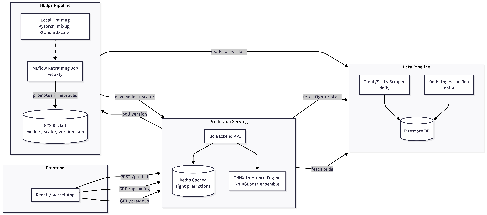

# UFC Fight Prediction & Analytics Platform

## Project Overview

This project is a fullstack ML platform used for predicting UFC fight outcomes. It contains an automated data pipeline, logic for feature engineering, training and inference on neural network and XGBoost using PyTorch and ONNX runtime, an automated retraining pipeline utilizing MLFlow tracking/logging with accuracy-gated model promotion, and a React frontend to deliver fight outcome predictions and track previous+upcoming fight predictions.

The app supports generating predictions for any matchup of UFC fighters, outputting picks for win probability and outcome type. Predictions are served from the backend in ~100ms (28ms on cache hit via Redis) thanks to a Go backend using Gin web framework, loading in models from a GCS storage bucket on startup. The NN and XGBoost models are trained on 50+ handcrafted features to capture dynamics of a fight, including momentum (win/finish streaks), elo ratings, rates of finishes, etc. Models are trained using mixup augmentation for tabular data to improve generalization and reduce overfitting.

Beyond fight outcome prediction, the platform also ingests live bookmaker odds and computes vig-adjusted expected value (EV) to surface fights where the model disagrees meaningfully with the market - highlighting potential value plays for upcoming events.

## Motivation

This project began as a simple stats dashboard I built to learn Pandas. However, I decided to transform it into an application that could predict UFC fight outcomes so that I could learn ML as well as fullstack development. By building a backend prediction system that supports accurate, low-latency predictions, as well as a full data scraping an engineering pipeline, I was able to learn lots of technical skills all while building a platform that displayed my passion for UFC and ML.

## Tech Stack & Architecture

**Frontend:** React, deployed on Vercel  
**Backend:** Go API leveraging concurrent model/stats loading and ONNX Runtime for low-latency inference, with Redis caching for repeated matchup queries.
**Machine Learning:** PyTorch neural network ensemble served via ONNX runtime, versioned and tracked through MLflow.

**Data Pipeline:**
- Automated scraper service (BeautifulSoup) deployed as scheduled Cloud Run job
- Runs daily to update fighter statistics, fight results, and prediction accuracy tracking
- Automated odds ingestion job pulling live bookmaker lines and computing vig-adjusted EV against model predictions
- Firestore NoSQL database to store fighter statistics for quick reads.

**MLOps Pipeline:**
- Weekly Cloud Run Job retrains the model ensemble on the latest fight data
- MLflow tracks experiment metrics, parameters, and artifacts for every training run
- New models are only promoted to production if they beat the current production accuracy
- Promoted models, scaler parameters, and a version manifest are pushed to GCS for the Go backend to load in updated models
- Scaler parameters are versioned and deployed atomically with model artifacts to eliminate training-serving skew

**Deployment:** API for predictions that handles reads from database, feature engineering, caching, and inference.

## Key Features

- **Real-time Predictions:** Generates fight winner probabilities and expected finish methods
- **Automated Data Pipeline:** Daily scraping and feature engineering of fighter statistics with Firestore storage
- **Low-Latency Prediction Serving:** Uses Goroutines for concurrent database + model loading calls in backend, with Redis caching for sub-30ms responses on repeated queries
- **Automated MLOps Lifecycle:** Weekly retraining, MLflow experiment tracking, accuracy-gated model promotion, and zero-downtime model hot-reloading
- **Odds & EV Analytics:** Live bookmaker odds ingestion with vig-adjusted expected value calculations, surfacing model vs. market disagreements
- **Production Architecture:** Containerized prediction service with cloud deployment and low latency

## Live Demo

**Frontend:** https://mma-predictor.vercel.app/